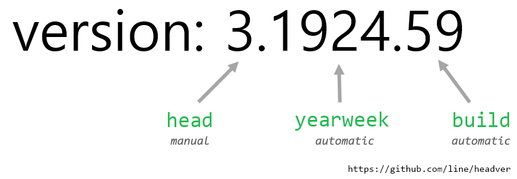

# HeadVer Specification

It says; the **3rd** public release, at around the **24th week of 2019**, from build **59**.

## Introduction

a version specification that has `{head}.{yearweek}.{build}` system.

The name `HeadVer` stands for **"only head number is enough to maintain!"** because it only allows to set the first number manually, and rest numbers are automatic. It simplifies `x.y.z` versioning and gurantees incremental version stamping on top of various versioning scripts introduced in this repository. HeadVer versioning system is battle-tested on the 30+ app/web services.

- `{head}` - manual. Zero-based number.
- `{yearweek}` - automatic. 2-digit for year and 2-digit for week number.
- `{build}` - automatic. incremental number from a build server.

## Code Examples

Currently, this repository has Bash, Fastlane, and Gradle examples. You can apply it to a build server or a local machine.

- Bash: [examples/bash.md](examples/bash.md)
- Fastlane: [examples/fastlane.md](examples/fastlane.md)
- Gradle: [examples/gradle.md](examples/gradle.md)

## Motivation

There are so many questions came out when we use a SemVer style.
- "Oops, we accidentally released without updating the version!" 
- "Why so many products are still having 1.x.y version? Do we have any chance to increase a major up?"
- "Why `update to 1.0.3` commit should be in commit history? The version number is not a logic but just a package tag."
- "User got a crash in version 1.4.3 but have no idea how old the version is. Is it outdated for months so?"
- "What was the affected version and how long did we take to get fixed?"
- "In this release, do we update a minor number or patch? We've discussed it all day long."

The HeadVer deeply thought these questions and defined rules to cover up all of them.

## Benefits

- It embraces [SemVer; Semantic Versioning](https://github.com/semver/semver). HeadVer is compatible with `x.y.z` style and easily moves over it.
- Every number in a version has clear meaning.
- The middle `{yearweek}` acknowledges an age of a version.
- It only allows one manual number, the `{head}`, to simplify a numbering consideration and discussion.
- The build number guarantees each release distinguishable.
- It is enough to say a `{build}` to point out exact release binary.
- No same version releases happen even we missed 'version up to x.x.x' commit.
- `{yearweek}` always has 4-digit long, so we have a minimum validation rule. Every version has fixed 4-digit in the middle.

## Rules

### 1. {head}
- The first part `{head}` is Zero-based manually modifiable number.
- For example, if you try to adopt HeadVer to a software that has v2.1.0, it is good to start with head number `3`.

### 2. {yearweek}
- The second part `{yearweek}` is a combination of 2-digit for a year and 2-digit week number. ie, 34th week in year 2021 is 2134.
- It always has 4-digit.
- A week number follows **ISO-8601** week date system; https://en.wikipedia.org/wiki/ISO_week_date

### 3. {build}
- The last part `{build}` is an automatically incremental number, and generally a build server stamps it.
- We strongly recommend to setup a build server with auto-incremental counter system in front of any software releases.

## Tips
- If your team is running a weekly sprint, middle number can be a sprint title as it raises per week. ie, `2104` can be a sprint for 4th week of 2021.
- If your team is running a bi-weekly sprint, middle number can also a sprint title as it can be odd or even number.
- When should we update `{head}` number? We recommend to increase at every end-user receives a new version. ie, for each AppStore releases.
- `{yearweek}` can be winded back to `0001` when year 2100 comes. When year 2100 comes, update `{head}` or use 4-digit for a year `210001`.

## FAQ
1. Can we use `-prerelease` for a version? Yes. But practically, we recommend you not to use `-prerelease`. It is good to update `{head}` instead. HeadVer leads to increase `{head}` frequently.
1. Can we use `+meta` for a version? Yes. it is perfectly fine.
1. Why not use `{yyyyMMdd}` but `{yearweek}`? Practically, week number precision is enough.
